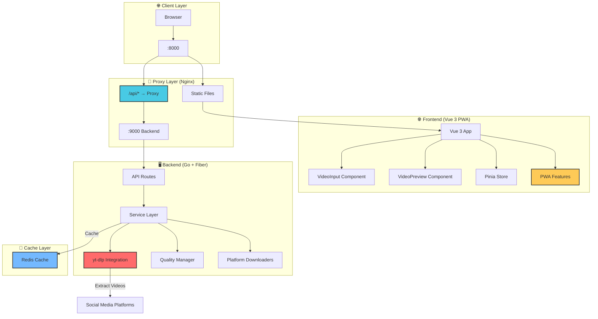

# 🎬 VidToGallery

> 📱 **Full-Stack Video Downloader** - A Progressive Web App (PWA) that extracts direct video URLs from social media platforms and saves them directly to your device gallery.

[](https://golang.org)
[](https://v3.vuejs.org/)
[](https://www.typescriptlang.org/)
[](https://gofiber.io)
[](https://redis.io)
[](https://docker.com)
[](https://web.dev/progressive-web-apps/)

## 🚀 Overview

VidToGallery is a complete full-stack solution for downloading videos from social media platforms. It consists of:

- **🖥️ Backend**: High-performance Go service using **yt-dlp** for video extraction
- **🌐 Frontend**: Vue 3 Progressive Web App with mobile-first design
- **💾 Cache**: Redis for optimized performance and caching

The application extracts direct video URLs without storing files locally, making it perfect for iOS devices to save videos directly to the photo gallery using `navigator.share()`.

### 🎯 Supported Platforms

| Platform | Status | URL Format |
|----------|--------|------------|
| 📸 **Instagram** | ✅ Ready | `instagram.com/p/*`, `instagram.com/reel/*` |
| 🐦 **Twitter/X** | ✅ Ready | `twitter.com/*/status/*`, `x.com/*/status/*` |
| 🎵 **TikTok** | ✅ Ready | `tiktok.com/*`, `vm.tiktok.com/*` |
| 📺 **YouTube** | ❌ Not Supported | Currently disabled |

## 🏗️ Architecture



### 🔄 Reverse Proxy Architecture

The production deployment uses **Nginx as a reverse proxy** for optimal security and performance:

1. **Single Entry Point**: Only port `8000` is exposed to the host
2. **Static Assets**: Nginx serves Vue.js build files directly  
3. **API Proxying**: All `/api/*` requests are proxied to the Go backend
4. **Internal Communication**: Backend and Redis communicate only within Docker network
5. **Security**: Backend is not directly accessible from outside the container network

**Request Flow:**
```
Browser → localhost:8000 → Nginx → /api/* → Backend:9000
                                 → /* → Vue.js Static Files
```

## 🛠️ Tech Stack

### Backend
- **Language**: Go 1.24+
- **Framework**: Fiber v2 (Express-like Go web framework)
- **Video Processing**: yt-dlp (Python-based video extraction)
- **Cache**: Redis 7
- **Documentation**: Swagger/OpenAPI

### Frontend
- **Framework**: Vue 3 with Composition API
- **Language**: TypeScript
- **UI Library**: Vant 4.x (Mobile-first Vue components)
- **State Management**: Pinia
- **Build Tool**: Vite 6.x
- **PWA**: vite-plugin-pwa

## 🚀 Quick Start

### 📋 Prerequisites

- 🐳 **Docker & Docker Compose** (recommended)
- 🔧 **VS Code with Dev Containers** (for development)

**Alternative local setup:**
- 🐹 **Go 1.24+** (backend)
- 📦 **Node.js 22+** (frontend)
- 🎥 **yt-dlp** (video extraction)
- 💾 **Redis** (caching)

### 🚀 Method 1: Dev Containers (Recommended)

This project is optimized for VS Code Dev Containers with separate environments for frontend and backend:

#### Frontend Development
```bash
# 1. Open project in VS Code
code /path/to/VidToGallery

# 2. Choose "Reopen in Container" → "Frontend"
# 3. Once in container, start development server:
npm run dev -- --host 0.0.0.0 --port 5173

# 🌐 Frontend available at: http://localhost:5173
```

#### Backend Development
```bash
# 1. Open new VS Code window with same project
# 2. Choose "Reopen in Container" → "Backend"
# 3. Start the backend with hot reload:
air

# 🖥️ Backend API available at: http://localhost:8080
# 📖 API Documentation: http://localhost:8080/swagger/
```

**Important**: Start the backend dev container first to create the shared network.

### 🐳 Method 2: Docker Compose (Production)

#### Full Stack Deployment
```bash
# Clone the repository
git clone <repository-url>
cd VidToGallery

docker network create --driver bridge --opt com.docker.network.driver.mtu=1500 --subnet 172.20.1.0/28 vidtogallery-network

# Start the complete stack
docker-compose up -d

# Services available:
# - Frontend (with Nginx proxy): http://localhost:8000
# - Backend API: internal only (via nginx proxy at /api/)
# - Redis: internal only

# View logs
docker-compose logs -f

# Stop all services
docker-compose down

# Stop and remove volumes
docker-compose down -v
```

#### Individual Component Deployment

**Backend Only:**
```bash
cd backend/deployments
docker-compose up -d

# Services:
# - Backend API: http://localhost:9000
# - Redis: http://localhost:6379
```

**Frontend Only:**
```bash
cd frontend
docker-compose up -d

# Service:
# - Frontend: http://localhost:8000
```

### 🔧 Method 3: Local Development

#### Backend Setup
```bash
cd backend

# Install dependencies
go mod tidy

# Build application
go build -o bin/server ./cmd/server

# Generate Swagger documentation
go run github.com/swaggo/swag/cmd/swag init -g cmd/server/main.go -o docs

# Start Redis (required)
redis-server

# Start server
./bin/server
# or with hot reload: air
```

#### Frontend Setup
```bash
cd frontend

# Install dependencies
npm install

# Start development server
npm run dev

# Build for production
npm run build

# Preview production build
npm run preview
```

## 📚 API Documentation

### 🌐 Endpoints

| Endpoint | Method | Description |
|----------|--------|-------------|
| `/health` | GET | 💚 Health check |
| `/api/v1/download` | POST | 🎬 Download video with quality |
| `/api/v1/qualities` | POST | 🎨 Get available video qualities |
| `/api/v1/proxy-download` | POST | 📥 Proxy download video file |
| `/swagger/` | GET | 📖 API documentation |

### 🎯 Example Usage

```bash
# 💚 Health check (direct to backend for development)
curl http://localhost:9000/health

# Production usage through nginx proxy:
# 🎨 Get available qualities
curl -X POST http://localhost:8000/api/v1/qualities \
  -H "Content-Type: application/json" \
  -d '{"url": "https://twitter.com/username/status/123456789"}'

# 🎬 Download video with specific quality
curl -X POST http://localhost:8000/api/v1/download \
  -H "Content-Type: application/json" \
  -d '{"url": "https://twitter.com/username/status/123456789", "quality": "720p"}'
```

## ⚙️ Configuration

### 🔧 Environment Variables

**Backend (.env in backend directory):**
```bash
# Server Configuration
PORT=9000
HOST=localhost

# Redis Configuration
REDIS_URL=redis://redis:6379
REDIS_PASSWORD=
REDIS_DB=0

# Cache Configuration
CACHE_TTL=24h
VIDEO_CACHE_TTL=24h

# Download Configuration
MAX_CONCURRENT_DOWNLOADS=5
DOWNLOAD_TIMEOUT=30s

# User Agent Configuration
ROTATE_USER_AGENTS=true
RANDOM_USER_AGENT_ORDER=true

# Environment
ENV=production
```

**Frontend (.env in frontend directory):**
```bash
# API Configuration (for development only)
# In production, API calls are proxied through nginx
VITE_API_URL=http://localhost:9000
```

## 📱 PWA Features

- **📲 Installable**: Can be installed on mobile devices and desktop
- **🔄 Offline Support**: Service worker caches assets for offline usage
- **📱 Responsive Design**: Mobile-first approach with Vant UI components
- **🌙 Dark Theme**: Automatic dark/light theme based on system preferences
- **👆 Touch Optimized**: Optimized for touch interactions
- **📋 Clipboard Integration**: One-click paste from clipboard
- **📤 Share API**: Native sharing using Web Share API

## 📂 Project Structure

```
VidToGallery/
├── 📂 backend/                 # Go backend service
│   ├── 📂 cmd/
│   │   ├── 📂 server/          # Main application
│   │   └── 📂 test-ua/         # User agent testing
│   ├── 📂 pkg/
│   │   ├── 📂 api/            # HTTP handlers & routes
│   │   ├── 📂 cache/          # Redis caching
│   │   ├── 📂 config/         # Configuration management
│   │   ├── 📂 downloader/     # Platform downloaders
│   │   ├── 📂 quality/        # Quality management
│   │   └── 📂 useragent/      # User agent rotation
│   ├── 📂 internal/
│   │   └── 📂 models/         # Data structures
│   ├── 📂 deployments/        # Docker & deployment
│   └── 📂 docs/              # Generated API docs
│
├── 📂 frontend/               # Vue 3 PWA frontend
│   ├── 📂 src/
│   │   ├── 📂 components/     # Vue components
│   │   ├── 📂 composables/    # Vue 3 composables
│   │   ├── 📂 stores/         # Pinia state stores
│   │   ├── 📂 views/          # Page components
│   │   └── 📂 router/         # Vue Router config
│   └── 📂 public/            # Static assets
│
└── 📂 .devcontainer/         # Dev container configurations
```

## 🛠️ Development Commands

### Backend Commands
```bash
# Development
air                    # Hot reload development
go run ./cmd/server   # Run without hot reload
go build -o bin/server ./cmd/server  # Build

# Documentation
go run github.com/swaggo/swag/cmd/swag init -g cmd/server/main.go -o docs

# Testing & Quality
go test ./...         # Run tests
go fmt ./...          # Format code
go vet ./...          # Lint code
```

### Frontend Commands
```bash
# Development
npm run dev           # Start development server
npm run build         # Build for production
npm run preview       # Preview production build

# Quality
npm run lint          # Run ESLint
```

## 🚀 Deployment Options

### 🐳 Docker Compose (Recommended)
- Complete stack with Redis
- Optimized for Raspberry Pi 5
- Production-ready configuration

### ☁️ Cloud Deployment
- Backend: Deploy Go binary with Redis
- Frontend: Static hosting (Netlify, Vercel, etc.)
- Configure `VITE_API_URL` to point to your backend

### 🏠 Self-Hosted
- Use provided Docker configurations
- Reverse proxy with Nginx/Caddy
- SSL termination recommended

## 🛡️ Browser Support

- **Modern Browsers**: Chrome 80+, Firefox 75+, Safari 13+, Edge 80+
- **PWA Support**: All modern browsers
- **Clipboard API**: Requires HTTPS in production
- **Web Share API**: Mobile browsers with native sharing

### Development Guidelines
- Follow existing code style and conventions
- Write meaningful commit messages
- Test your changes thoroughly
- Update documentation as needed

## ⚠️ Disclaimer

This project is designed for educational and personal use only. Users are responsible for ensuring they comply with the terms of service of the platforms from which they download content. The developers of this project do not encourage or endorse the downloading of copyrighted content without proper authorization. Please respect intellectual property rights and use this tool responsibly.

## 👨‍💻 Author

**devidence.dev**

- Website: [devidence.dev](https://devidence.dev)
- GitHub: [@devidence](https://github.com/devidence)

---

Made with ❤️ by [devidence.dev](https://devidence.dev)
