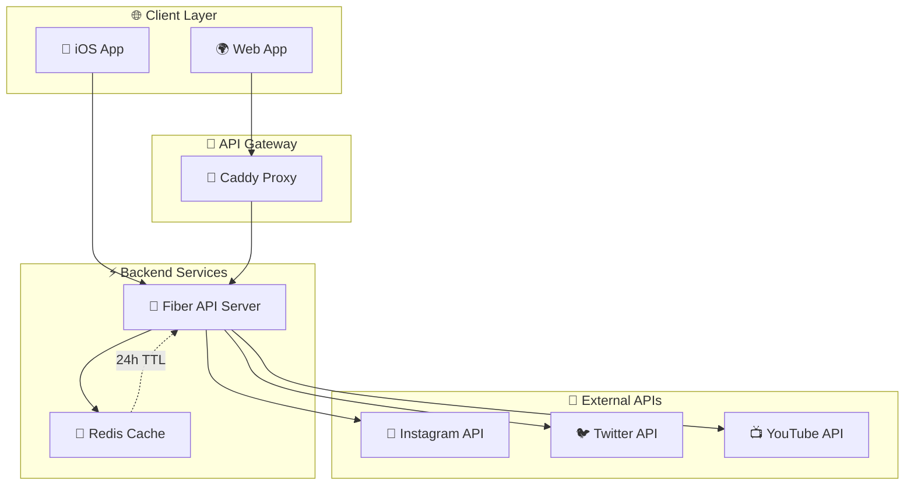

# 🎬 VidToGallery

> 📱 **iOS-focused video downloader** that extracts direct video URLs from social media platforms without storing videos locally.

[](https://golang.org)
[](https://gofiber.io)
[](https://redis.io)
[](https://docker.com)
[](http://localhost:8080/swagger/)

## 🚀 Overview

VidToGallery is a high-performance Go backend service that extracts video download URLs from popular social media platforms using **yt-dlp**. Designed specifically for iOS applications, it returns direct video URLs that can be used with `navigator.share()` to save videos directly to the iOS photo gallery.

### 🔧 How It Works

The service leverages **yt-dlp** (a powerful Python-based video extraction tool) as its core engine for video processing:

1. **URL Analysis**: Detects platform type from the provided URL
2. **yt-dlp Integration**: Executes yt-dlp commands to extract video metadata and formats
3. **Quality Selection**: Filters available video formats based on requested quality
4. **Direct URL Extraction**: Returns direct video URLs without storing files locally
5. **Smart Caching**: Caches results with quality-specific keys for optimal performance

### 🎯 Supported Platforms

| Platform | Status | URL Format |
|----------|--------|------------|
| 📸 **Instagram** | ✅ Ready | `instagram.com/p/*`, `instagram.com/reel/*` |
| 🐦 **Twitter/X** | ✅ Ready | `twitter.com/*/status/*`, `x.com/*/status/*` |
| 🎵 **TikTok** | ✅ Ready | `tiktok.com/*`, `vm.tiktok.com/*` |
| 📺 **YouTube** | ❌ Not Supported | Currently disabled |

## 🏗️ Architecture



## 🛠️ Quick Start

### 📋 Prerequisites

- 🐳 **Docker & Dev Containers** (recommended)
- 🔧 **Go 1.24+** (for development)
- 📦 **Redis** (for caching)
- 🎥 **yt-dlp** (for video extraction) - *The service uses yt-dlp as its core engine to extract video metadata and download URLs from social media platforms*

### 🚀 Method 1: Dev Container (Recommended)

This project is optimized for development using VS Code Dev Containers:

```bash
# 📁 Open in VS Code with Dev Container
code .

# 🏗️ Build the application (inside dev container)
go build -o bin/server ./cmd/server

# 🎯 Generate Swagger documentation
go run github.com/swaggo/swag/cmd/swag init -g cmd/server/main.go -o docs

# ⚡ Start the server
./bin/server

# 🔄 Or run directly
go run ./cmd/server
```

### 🔧 Method 2: Local Development

```bash
# 🏗️ Build the application
cd /workspace
go build -o bin/server ./cmd/server

# 🎯 Generate Swagger documentation
go run github.com/swaggo/swag/cmd/swag init -g cmd/server/main.go -o docs

# ⚡ Start the server
./bin/server

# 🔄 Or run directly
go run ./cmd/server
```

## 📚 API Documentation

### 🌐 Endpoints

| Endpoint | Method | Description |
|----------|--------|-------------|
| `/health` | GET | 💚 Health check |
| `/api/v1/download` | POST | 🎬 Download video with quality |
| `/api/v1/qualities` | POST | 🎨 Get available video qualities |
| `/api/v1/proxy-download` | POST | 📥 Proxy download video file |
| `/swagger/` | GET | 📖 API documentation |

### 🎯 Example Usage

```bash
# 💚 Health check
curl http://localhost:8080/health

# 🎨 Get available qualities
curl -X POST http://localhost:8080/api/v1/qualities \
  -H "Content-Type: application/json" \
  -d '{"url": "https://twitter.com/username/status/123456789"}'

# 🎬 Download video with specific quality
curl -X POST http://localhost:8080/api/v1/download \
  -H "Content-Type: application/json" \
  -d '{"url": "https://twitter.com/username/status/123456789", "quality": "720p"}'

# 📥 Proxy download video file
curl -X POST http://localhost:8080/api/v1/proxy-download \
  -H "Content-Type: application/json" \
  -d '{"video_url": "https://video-cdn.example.com/video.mp4"}'

# 📖 View API documentation
open http://localhost:8080/swagger/
```

### 📝 Response Format

```json
{
  "video_url": "https://video-cdn.example.com/video.mp4",
  "title": "Amazing video title",
  "platform": "twitter",
  "quality": "best[height<=720]",
  "processed_at": "2024-01-01T12:00:00Z",
  "metadata": {
    "source": "https://twitter.com/username/status/123456789",
    "description": "Video description",
    "duration": "45.0",
    "thumbnail": "https://thumbnail-url.jpg"
  }
}
```

## ⚙️ Configuration

### 🔧 Environment Variables

```bash
# 🌐 Server Configuration
PORT=8080
HOST=localhost

# 💾 Redis Configuration
REDIS_URL=redis://localhost:6379
REDIS_PASSWORD=
REDIS_DB=0

# ⏰ Cache Configuration
CACHE_TTL=24h
VIDEO_CACHE_TTL=24h

# 📥 Download Configuration
MAX_CONCURRENT_DOWNLOADS=5
DOWNLOAD_TIMEOUT=30s

# 🎭 User Agent Configuration
ROTATE_USER_AGENTS=true
RANDOM_USER_AGENT_ORDER=true

# 🔧 Environment
ENV=development
```

## 🚀 Development

### 📋 Component Responsibilities

| Component | Responsibility |
|-----------|---------------|
| 🌐 **HTTP API** | REST endpoints & request handling |
| ⚙️ **Service Layer** | Business logic orchestration |
| 📥 **Downloader Service** | Platform detection & video processing |
| 🎨 **Quality Manager** | Quality selection & resolution handling |
| 💾 **Cache Service** | Redis-based caching layer |
| 📱 **Platform Downloaders** | Platform-specific video extraction |

### 🛠️ yt-dlp Integration

VidToGallery uses **yt-dlp** as its primary video extraction engine:

```bash
# Example yt-dlp commands executed by the service:
yt-dlp --dump-json --no-download <video_url>  # Extract metadata
yt-dlp -f "best[height<=720]" --get-url <video_url>  # Get quality-specific URL
```

**Key Features:**
- 🎯 **Quality-specific extraction**: Requests specific video qualities (360p, 720p, best, worst)
- 🔄 **JSON metadata parsing**: Extracts title, duration, thumbnail, and available formats
- 🚀 **No file downloads**: Only extracts direct URLs, keeping the service lightweight
- 🛡️ **Error handling**: Graceful handling of unsupported URLs or platform restrictions

### 📁 Project Structure

```
📦 vidtogallery/
├── 📂 cmd/
│   └── 📂 server/          # 🎯 Main application
├── 📂 pkg/
│   ├── 📂 api/            # 🌐 HTTP handlers & routes
│   ├── 📂 cache/          # 💾 Redis caching
│   ├── 📂 config/         # ⚙️ Configuration management
│   ├── 📂 downloader/     # 📥 Platform downloaders
│   └── 📂 useragent/      # 🎭 User agent rotation
├── 📂 internal/
│   └── 📂 models/         # 📊 Data structures
├── 📂 deployments/        # 🐳 Docker & deployment
├── 📂 docs/              # 📖 Generated API docs
└── 📂 scripts/           # 🔧 Utility scripts
```

### 🔧 Development Commands

```bash
# 🏗️ Build application
go build -o bin/server ./cmd/server

# 🎯 Generate Swagger docs
go run github.com/swaggo/swag/cmd/swag init -g cmd/server/main.go -o docs

# 🧪 Run tests
go test ./...

# 🔧 Install dependencies
go mod tidy

# 🎭 Test user agent rotation
go run ./cmd/test-ua

# 📊 Format code
go fmt ./...

# 🔍 Lint code
go vet ./...
```

## 🚀 Production Deployment

### 🏭 Build for Raspberry Pi 5

```bash
# 🏗️ Direct build for ARM64 (using defaults)
docker build -f deployments/Dockerfile -t vidtogallery:arm64 .

# 🏗️ Or specify platform explicitly
docker buildx build --platform linux/arm64 \
  -t vidtogallery:arm64 \
  -f deployments/Dockerfile .
```

### 🐳 Docker Compose Deployment

```bash
# 📁 Navigate to deployments directory
cd deployments/

# 🚀 Start services in production mode
docker-compose up -d

# 📊 Check service status
docker-compose ps

# 📋 View logs
docker-compose logs -f app
docker-compose logs -f redis

# 🔄 Update application
docker-compose pull
docker-compose up -d --force-recreate app

# 🛑 Stop services
docker-compose down
```

### 🔧 Production Setup on Raspberry Pi 5

1. **Prepare the system:**
```bash
# 📦 Update system
sudo apt update && sudo apt upgrade -y

# 🐳 Install Docker
curl -fsSL https://get.docker.com -o get-docker.sh
sudo sh get-docker.sh
sudo usermod -aG docker $USER

# 📁 Create data directory
sudo mkdir -p /opt/vidtogallery/redis_data
sudo chown $USER:$USER /opt/vidtogallery/redis_data
```

2. **Deploy the application:**
```bash
# 📥 Clone repository
git clone <your-repo-url>
cd vidtogallery/deployments

# ⚙️ Create environment file
cp ../.env.example .env
# Edit .env with your configuration

# 🚀 Start services
docker-compose up -d

# ✅ Verify deployment
curl http://localhost:8080/health
```

### 🔐 Security Considerations

- **Firewall Configuration:**
```bash
# 🔥 Configure UFW firewall
sudo ufw allow 22/tcp      # SSH
sudo ufw allow 8080/tcp    # Application
sudo ufw enable
```

- **SSL/TLS Setup (recommended):**
```bash
# 🔒 Use reverse proxy (nginx/caddy) for HTTPS
# Example nginx configuration in /etc/nginx/sites-available/vidtogallery
```

### 📊 Monitoring & Maintenance

```bash
# 💚 Health check
curl http://localhost:8080/health

# 📊 Container stats
docker stats vidtogallery-app vidtogallery-redis

# 🗂️ Clean up unused images
docker system prune -a

# 💾 Backup Redis data
docker exec vidtogallery-redis redis-cli BGSAVE
sudo cp /opt/vidtogallery/redis_data/dump.rdb /backup/
```

### ⚙️ Configuration for Production

Environment variables in `.env`:
```bash
# 🌐 Server
PORT=8080
HOST=0.0.0.0

# 💾 Redis
REDIS_URL=redis://redis:6379
REDIS_PASSWORD=your_secure_password

# ⏰ Cache
CACHE_TTL=24h
VIDEO_CACHE_TTL=24h

# 🔧 Performance
MAX_CONCURRENT_DOWNLOADS=5
DOWNLOAD_TIMEOUT=30s
GOMAXPROCS=4

# 🎭 User Agent
ROTATE_USER_AGENTS=true

# 🛡️ Security
ENV=production
```

### 🏭 Multi-Architecture Build

```bash
# 🏗️ Build for multiple architectures
docker buildx build --platform linux/amd64,linux/arm64 \
  -t vidtogallery:latest \
  -f deployments/Dockerfile .
```

### 📊 Monitoring

- 💚 **Health Check**: `GET /health`
- 📖 **API Docs**: `GET /swagger/`
- 🔧 **Metrics**: Coming soon (Prometheus)

## 🤝 Contributing

1. 🍴 Fork the repository
2. 🌿 Create a feature branch
3. 💾 Commit your changes
4. 📤 Push to the branch
5. 🔄 Create a Pull Request

## ⚠️ Disclaimer

**IMPORTANT NOTICE**: This software is provided for educational and personal use only. The developers and contributors of VidToGallery:

- 🚫 **Do NOT endorse** or encourage the downloading of copyrighted content without proper authorization
- 🛡️ **Are NOT responsible** for any misuse, illegal activities, or copyright violations committed by users
- ⚖️ **Users are solely responsible** for ensuring their use complies with applicable laws and platform terms of service
- 📋 **Respect content creators** and platform policies when using this software

**Use this software responsibly and at your own risk.**

## 📄 License

This project is licensed under the MIT License - see the [LICENSE](LICENSE) file for details.

## 🔗 Links

- 📖 **API Documentation**: http://localhost:8080/swagger/

---

<div align="center">

**⭐ Star this repo if you find it useful!**

Made with ❤️ by devidence.dev 

</div>
