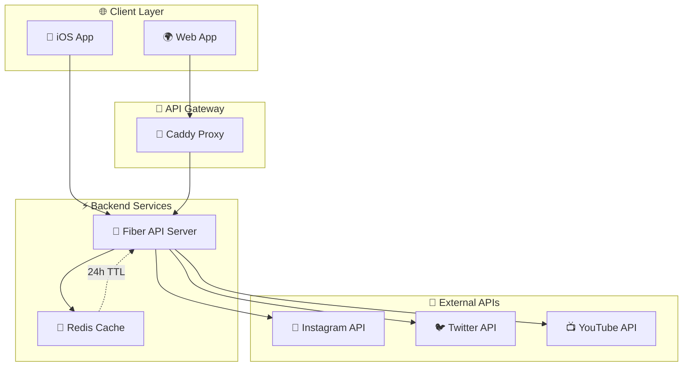
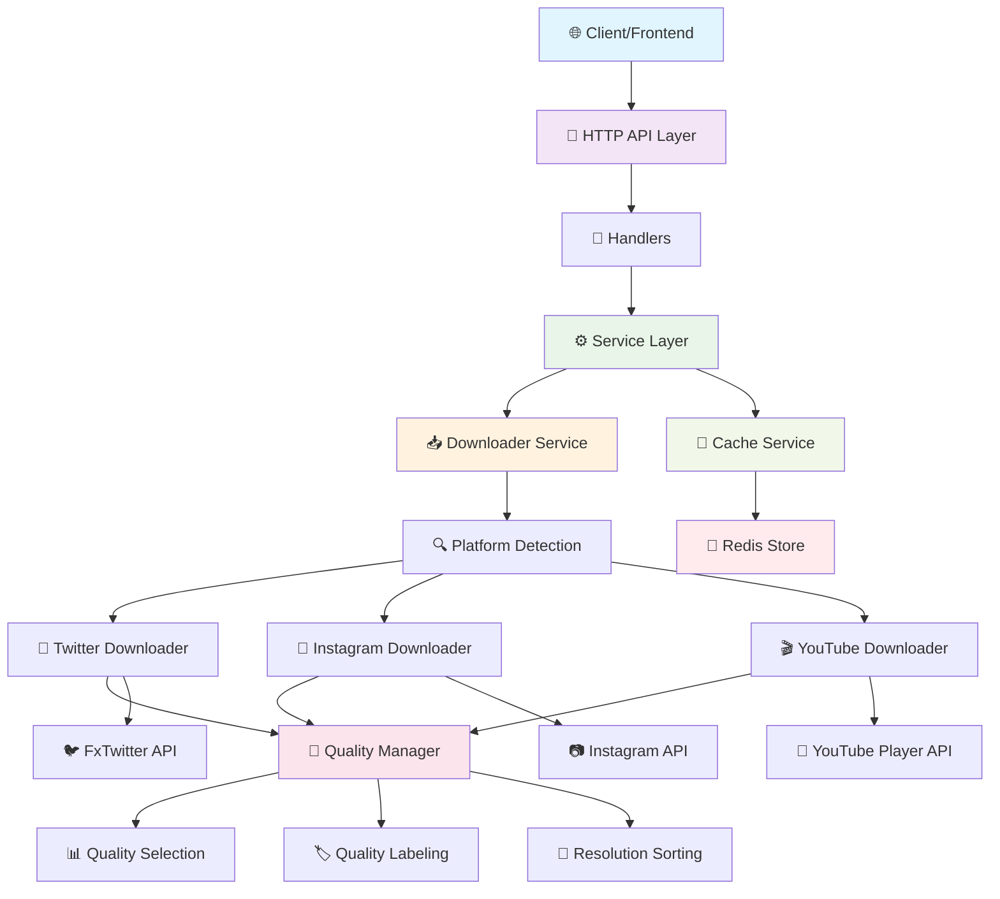

# 🎬 VidToGallery

> 📱 **iOS-focused video downloader** that extracts direct video URLs from social media platforms without storing videos locally.

[](https://golang.org)
[](https://gofiber.io)
[](https://redis.io)
[](https://docker.com)
[](http://localhost:8080/swagger/)

## 🚀 Overview

VidToGallery is a high-performance Go backend service that extracts video download URLs from popular social media platforms. Designed specifically for iOS applications, it returns direct video URLs that can be used with `navigator.share()` to save videos directly to the iOS photo gallery.

### 🎯 Supported Platforms

| Platform | Status | URL Format |
|----------|--------|------------|
| 📸 **Instagram** | ✅ Ready | `instagram.com/p/*`, `instagram.com/reel/*` |
| 🐦 **Twitter/X** | ✅ Ready | `twitter.com/*/status/*`, `x.com/*/status/*` |
| 📺 **YouTube** | ✅ Ready | `youtube.com/watch?v=*`, `youtu.be/*`, `youtube.com/shorts/*` |
| 🎵 **TikTok** | 🚧 Planned | Coming soon |

## 🏗️ Architecture



## 🛠️ Quick Start

### 📋 Prerequisites

- 🐳 **Docker & Docker Compose** (recommended)
- 🔧 **Go 1.21+** (for development)
- 📦 **Redis** (for caching)

### 🚀 Method 1: Docker Compose (Recommended)

```bash
# 📁 Navigate to deployments directory
cd deployments

# 🔧 Create environment file
cp ../.env.example ../.env

# 🚀 Build and start services
./deploy.sh build
./deploy.sh up

# 🌍 With reverse proxy (Caddy)
./deploy.sh up-proxy

# 📊 Check service status
./deploy.sh status

# 📝 View logs
./deploy.sh logs
```

### 🔧 Method 2: Dev Container (Development)

```bash
# 🏗️ Build the application
cd /workspace
go build -o bin/server ./cmd/server

# 🎯 Generate Swagger documentation
go run github.com/swaggo/swag/cmd/swag init -g cmd/server/main.go -o docs

# ⚡ Start the server
./bin/server

# 🔄 Or run directly
go run ./cmd/server
```

### 🐳 Method 3: Local Docker Build

```bash
# 🏗️ Build Docker image
docker build -t vidtogallery:latest -f deployments/Dockerfile .

# 🚀 Run with Redis
docker run -d --name redis redis:7-alpine
docker run -d --name vidtogallery \
  --link redis:redis \
  -p 8080:8080 \
  -e REDIS_URL=redis://redis:6379 \
  vidtogallery:latest
```

## 📚 API Documentation

### 🌐 Endpoints

| Endpoint | Method | Description |
|----------|--------|-------------|
| `/health` | GET | 💚 Health check |
| `/api/v1/process` | POST | 🎬 Process video URL |
| `/swagger/` | GET | 📖 API documentation |

### 🎯 Example Usage

```bash
# 💚 Health check
curl http://localhost:8080/health

# 🎬 Process Instagram video
curl -X POST http://localhost:8080/api/v1/process \
  -H "Content-Type: application/json" \
  -d '{"url": "https://www.instagram.com/p/ABC123/"}'

# 📖 View API documentation
open http://localhost:8080/swagger/
```

### 📝 Response Format

```json
{
  "video_url": "https://video-cdn.example.com/video.mp4",
  "title": "Amazing video title",
  "platform": "instagram",
  "quality": "720p",
  "processed_at": "2024-01-01T12:00:00Z",
  "metadata": {
    "source": "https://www.instagram.com/p/ABC123/",
    "video_id": "ABC123",
    "duration": "30s"
  }
}
```

## ⚙️ Configuration

### 🔧 Environment Variables

```bash
# 🌐 Server Configuration
PORT=8080
HOST=localhost

# 💾 Redis Configuration
REDIS_URL=redis://localhost:6379
REDIS_PASSWORD=
REDIS_DB=0

# ⏰ Cache Configuration
CACHE_TTL=24h
VIDEO_CACHE_TTL=24h

# 📥 Download Configuration
MAX_CONCURRENT_DOWNLOADS=5
DOWNLOAD_TIMEOUT=30s

# 🎭 User Agent Configuration
ROTATE_USER_AGENTS=true
RANDOM_USER_AGENT_ORDER=true

# 🔧 Environment
ENV=development
```

## 🚀 Development

### 🏗️ Architecture



### 📋 Component Responsibilities

| Component | Responsibility |
|-----------|---------------|
| 🌐 **HTTP API** | REST endpoints & request handling |
| ⚙️ **Service Layer** | Business logic orchestration |
| 📥 **Downloader Service** | Platform detection & video processing |
| 🎨 **Quality Manager** | Quality selection & resolution handling |
| 💾 **Cache Service** | Redis-based caching layer |
| 📱 **Platform Downloaders** | Platform-specific video extraction |

### 📁 Project Structure

```
📦 vidtogallery/
├── 📂 cmd/
│   └── 📂 server/          # 🎯 Main application
├── 📂 pkg/
│   ├── 📂 api/            # 🌐 HTTP handlers & routes
│   ├── 📂 cache/          # 💾 Redis caching
│   ├── 📂 config/         # ⚙️ Configuration management
│   ├── 📂 downloader/     # 📥 Platform downloaders
│   └── 📂 useragent/      # 🎭 User agent rotation
├── 📂 internal/
│   └── 📂 models/         # 📊 Data structures
├── 📂 deployments/        # 🐳 Docker & deployment
├── 📂 docs/              # 📖 Generated API docs
└── 📂 scripts/           # 🔧 Utility scripts
```

### 🔧 Development Commands

```bash
# 🏗️ Build application
go build -o bin/server ./cmd/server

# 🎯 Generate Swagger docs
go run github.com/swaggo/swag/cmd/swag init -g cmd/server/main.go -o docs

# 🧪 Run tests
go test ./...

# 🔧 Install dependencies
go mod tidy

# 🎭 Test user agent rotation
go run ./cmd/test-ua

# 📊 Format code
go fmt ./...

# 🔍 Lint code
go vet ./...
```

### 🐳 Docker Commands

```bash
# 🏗️ Build services
./deployments/deploy.sh build

# 🚀 Start all services
./deployments/deploy.sh up

# 🌍 Start with proxy
./deployments/deploy.sh up-proxy

# 🛑 Stop services
./deployments/deploy.sh down

# 🔄 Restart services
./deployments/deploy.sh restart

# 📝 View logs
./deployments/deploy.sh logs

# 📊 Check status
./deployments/deploy.sh status

# 🧹 Clean up
./deployments/deploy.sh clean
```

## 🚀 Production Deployment

### 🏭 Multi-Architecture Build

```bash
# 🏗️ Build for multiple architectures
docker buildx build --platform linux/amd64,linux/arm64 \
  -t vidtogallery:latest \
  -f deployments/Dockerfile .
```

### 📊 Monitoring

- 💚 **Health Check**: `GET /health`
- 📖 **API Docs**: `GET /swagger/`
- 🔧 **Metrics**: Coming soon (Prometheus)

## 🤝 Contributing

1. 🍴 Fork the repository
2. 🌿 Create a feature branch
3. 💾 Commit your changes
4. 📤 Push to the branch
5. 🔄 Create a Pull Request

## ⚠️ Disclaimer

**IMPORTANT NOTICE**: This software is provided for educational and personal use only. The developers and contributors of VidToGallery:

- 🚫 **Do NOT endorse** or encourage the downloading of copyrighted content without proper authorization
- 🛡️ **Are NOT responsible** for any misuse, illegal activities, or copyright violations committed by users
- ⚖️ **Users are solely responsible** for ensuring their use complies with applicable laws and platform terms of service
- 📋 **Respect content creators** and platform policies when using this software

**Use this software responsibly and at your own risk.**

## 📄 License

This project is licensed under the MIT License - see the [LICENSE](LICENSE) file for details.

## 🔗 Links

- 📖 **API Documentation**: http://localhost:8080/swagger/
- 🐳 **Docker Hub**: Coming soon
- 📊 **GitHub**: Repository link
- 💬 **Support**: Create an issue

---

<div align="center">

**⭐ Star this repo if you find it useful!**

Made with ❤️ and Go

</div>
