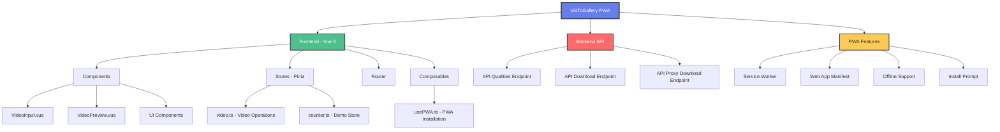

# VidToGallery

A Progressive Web App (PWA) for downloading videos directly to your device gallery. Built with Vue 3, TypeScript, and Vite.

[](https://v3.vuejs.org/)
[](https://www.typescriptlang.org/)
[](https://vitejs.dev/)
[](https://vant-ui.github.io/vant/)
[](https://pinia.vuejs.org/)
[](https://web.dev/progressive-web-apps/)
[](https://www.docker.com/)

## 📋 Table of Contents

- [🛠️ Tech Stack](#️-tech-stack)
- [🏗️ Project Architecture](#️-project-architecture)
- [🚀 Recommended Development Setup](#-recommended-development-setup)
- [🐳 Production Deployment](#-production-deployment)
- [📱 PWA Features](#-pwa-features)
- [🎯 Key Features](#-key-features)
- [📂 Project Structure](#-project-structure)
- [🛡️ Browser Support](#️-browser-support)
- [📋 API Endpoints](#-api-endpoints)
- [🎨 Theming](#-theming)
- [🤝 Contributing](#-contributing)
- [📄 License](#-license)
- [👨‍💻 Author](#-author)

## 🛠️ Tech Stack

- **Frontend Framework**: Vue 3 with Composition API
- **Build Tool**: Vite 6.x for fast development and optimized builds
- **Language**: TypeScript for type safety
- **UI Library**: Vant 4.x (Mobile-first Vue UI library)
- **State Management**: Pinia for reactive state management
- **Routing**: Vue Router for SPA navigation
- **PWA**: vite-plugin-pwa for Progressive Web App capabilities
- **Styling**: CSS3 with CSS Variables for theming
- **Linting**: ESLint with Vue TypeScript configuration
- **Deployment**: Docker with Nginx for production

## 🏗️ Project Architecture



## 🚀 Recommended Development Setup

### Using Dev Containers (Recommended)

This project is optimized for development using **VS Code Dev Containers**, which provides a consistent, isolated development environment.

#### Prerequisites
- [VS Code](https://code.visualstudio.com/)
- [Docker Desktop](https://www.docker.com/products/docker-desktop/)
- [Dev Containers Extension](https://marketplace.visualstudio.com/items?itemName=ms-vscode-remote.remote-containers)

#### Getting Started
1. Clone the repository
2. Open in VS Code
3. When prompted, click "Reopen in Container" or use `Ctrl+Shift+P` → "Dev Containers: Reopen in Container"
4. The dev container will automatically:
   - Install Node.js 22
   - Install all dependencies
   - Configure the development environment
   - Start the development server on `http://localhost:5173`

### Manual Setup (Alternative)

If you prefer to run the project locally without containers:

#### Prerequisites
- Node.js 22.x or higher
- npm 10.x or higher

#### Installation
```sh
npm install
```

#### Development Commands
```sh
# Start development server with hot reload
npm run dev

# Type check, compile and minify for production
npm run build

# Preview production build
npm run preview

# Run ESLint
npm run lint
```

## 🐳 Production Deployment

The project includes Docker configuration for production deployment:

```sh
# Build and run with Docker Compose
docker-compose up -d

# Access the application at http://localhost:80
```

## 📱 PWA Features

- **Installable**: Can be installed on mobile devices and desktop
- **Offline Support**: Service worker caches assets for offline usage
- **Responsive Design**: Mobile-first approach with Vant UI components
- **Dark Theme**: Automatic dark/light theme based on system preferences
- **Touch Optimized**: Optimized for touch interactions

## 🎯 Key Features

- **Video URL Input**: Paste video URLs from various platforms
- **Quality Selection**: Choose from available video qualities
- **Video Processing**: Download and process videos through backend API
- **Gallery Integration**: Save videos directly to device gallery
- **File Download**: Download videos as files
- **Share Functionality**: Share videos using Web Share API
- **Clipboard Integration**: One-click paste from clipboard

## 📂 Project Structure

```
src/
├── components/          # Reusable Vue components
│   ├── VideoInput.vue   # URL input and quality selection
│   ├── VideoPreview.vue # Video preview and actions
│   └── icons/          # SVG icon components
├── composables/        # Vue 3 composables
│   └── usePWA.ts      # PWA installation logic
├── stores/            # Pinia state stores
│   └── video.ts       # Video operations state
├── views/             # Page components
│   └── HomeView.vue   # Main application view
├── router/            # Vue Router configuration
└── assets/            # Static assets and styles
```

## 🛡️ Browser Support

- **Modern Browsers**: Chrome 80+, Firefox 75+, Safari 13+, Edge 80+
- **PWA Support**: Chrome, Firefox, Safari, Edge
- **Clipboard API**: Requires HTTPS in production
- **Web Share API**: Mobile browsers with native sharing support

## 📋 API Endpoints

The frontend communicates with a backend API through these endpoints:

- `POST /api/v1/qualities` - Get available video qualities
- `POST /api/v1/download` - Process and download video
- `POST /api/v1/proxy-download` - Proxy video file download

## 🎨 Theming

The application supports automatic dark/light theme switching based on system preferences using CSS custom properties and `prefers-color-scheme` media queries.

## 🤝 Contributing

Contributions are welcome! Please feel free to submit a Pull Request.

### Development Guidelines

1. Follow the existing code style and conventions
2. Write meaningful commit messages
3. Test your changes thoroughly
4. Update documentation as needed
5. Ensure all linting passes with `npm run lint`

## 📄 License

This project is licensed under the MIT License - see the [LICENSE](LICENSE) file for details.

## 👨‍💻 Author

**devidence.dev**

- Website: [devidence.dev](https://devidence.dev)
- GitHub: [@devidence](https://github.com/devidence)

---

Made with ❤️ by [devidence.dev](https://devidence.dev)
